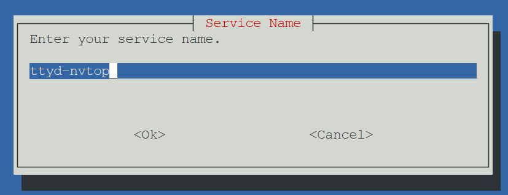
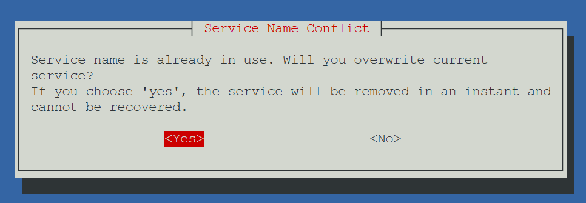
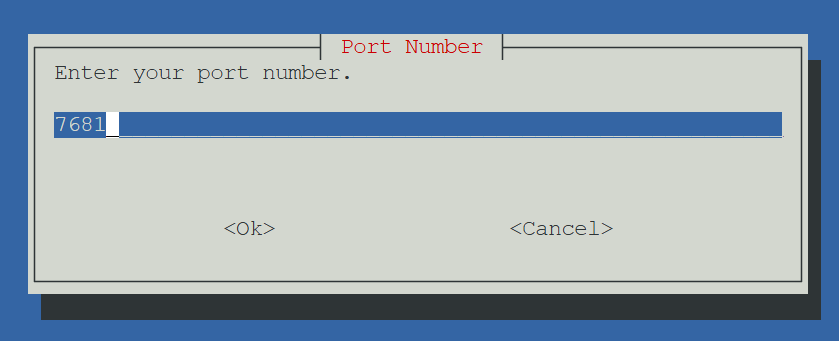
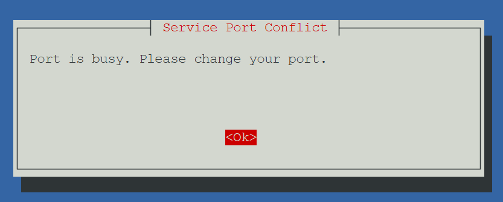
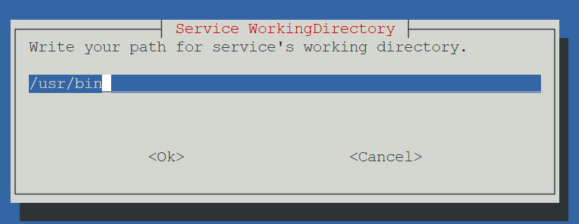
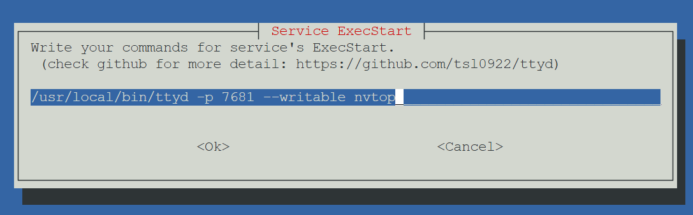
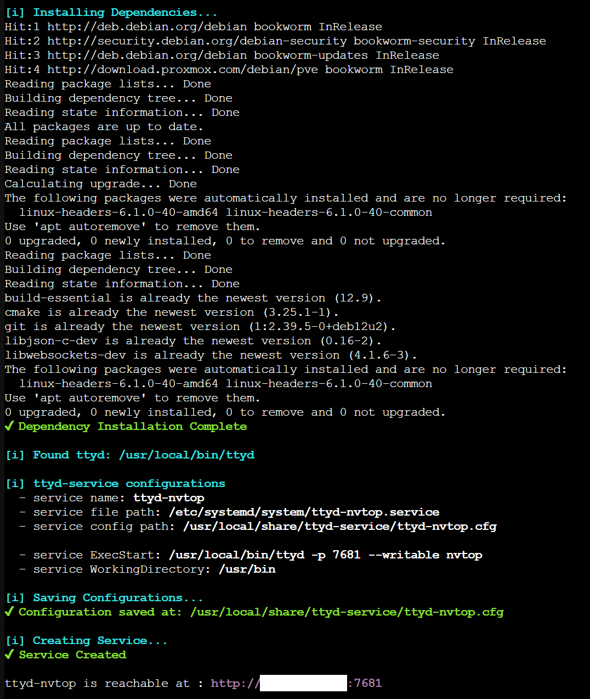
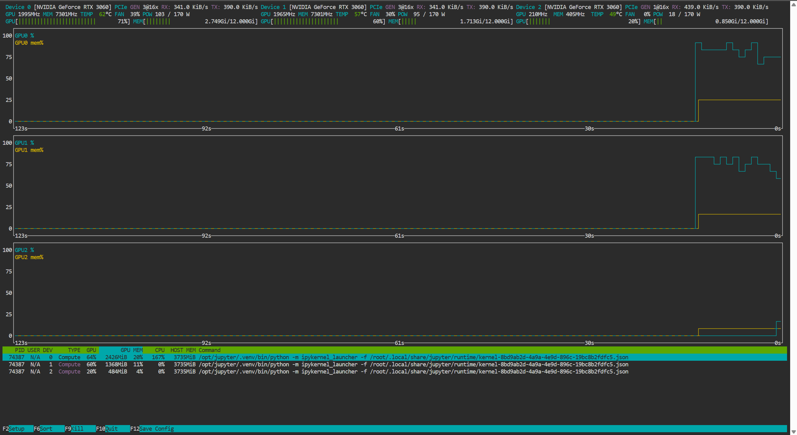

# ttyd-service

ttyd-service installer for Linux

Please visit the [ttyd repository](https://github.com/tsl0922/ttyd) for more information.

## Features

- Interactive configuration with **whiptail**
- Automatic conflict detection on **Service name** & **Port number**
- Fully customizable **ExecStart** & **WorkingDirectory**
- Single script execution

<br/>

*List of supported Distribution:*
- Debian
- Ubuntu

<br/>

## How to Install

Copy & paste the below command in the terminal:
```
bash -c "$(wget -qLO - https://raw.githubusercontent.com/KimYoungNo/ttyd-service/refs/heads/main/ttyd-service-install.sh)"
```

## Procedure

After executing the command above, the next procedures automatically begin:

1. System package updates & upgrade
2. Dependency installation
3. ttyd installation & compilation
4. ttyd-service configuation
5. Service unit creation & enabling

<br/>

## Simple Demo with nvtop

In procedure 4, you will see the configuration screen.

<br/>



The first configuration is **Service Name**. It is the name of your service unit file.

Default: *ttyd-service*

<br/>



If the name is already in use, it will pop up a service name conflict warning. You can choose one between overwriting or suspending.

*yes*: delete and regenerate the service

*no*: suspend the installation immediately

<br/>



The second configuration is **Port Number**. It is the serving port of your ttyd.

Default: *7681*

<br/>



If the port is already busy, it will pop up a service port conflict warning. The only thing possible is changing your port number.

<br/>



Third configuration is **WorkingDirectory**. It becomes the WorkingDirectory line of the service unit file.

Default: */usr/bin*

<br/>



The last configuration is **ExecStart**. It becomes the ExecStart line of the service unit file.

It is automatically filled out with an absolute path of the ttyd binary and port argument.

You should enter your argument (or command); otherwise, the service will fail (invalid ExecStart).

To fill out ExecStart, please visit the [ttyd repository](https://github.com/tsl0922/ttyd) for command line arguments and options.

<br/>



Here is the screen after finishing the installation. You can use your ttyd-service through the suggested URL at the bottom.

<br/>



And here is the screen that shows how actually the nvtop is shared through ttyd. You can access all functionality of nvtop if **--writable** (or -W) option is set.
